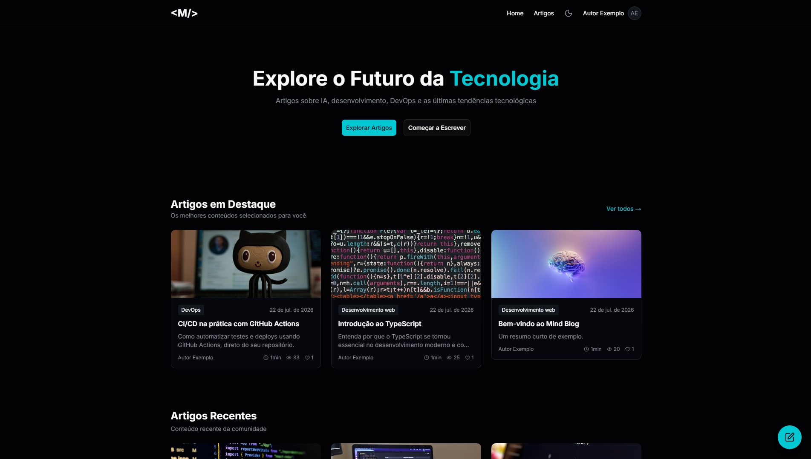
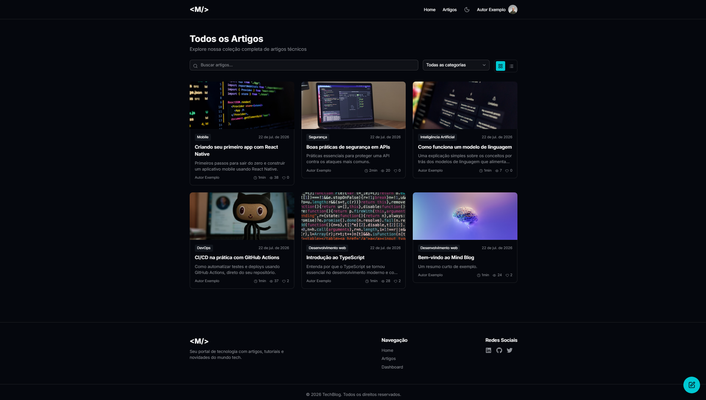
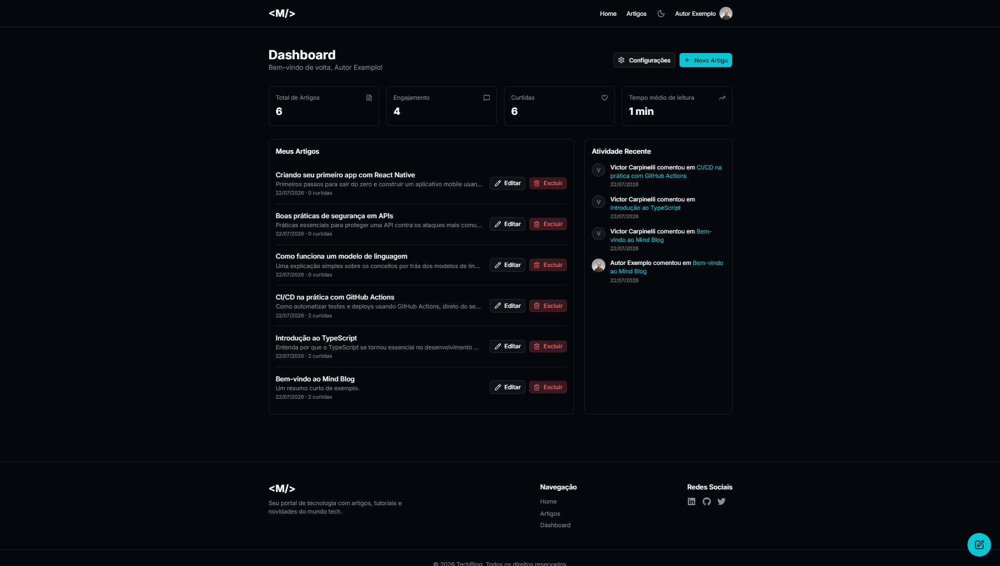
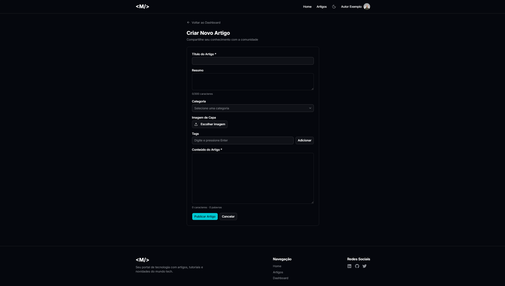

# Mind Blog: Frontend

Interface web do sistema de blog do case de estágio da Mind Consulting. Feita em React com TypeScript, consumindo a API do [backend](https://github.com/carpinellx/mind-blog-backend).

## Stack

React + Vite + TypeScript, Tailwind CSS + shadcn/ui (sobre Radix UI) para os componentes, React Router para navegação, Axios para comunicação com a API, Context API para autenticação e tema.

Optei por Vite em vez de Next.js porque o escopo do projeto não pedia SSR nem rotas de API do lado do servidor. Com Vite, controlo diretamente o roteamento (React Router) e o fetch de dados, sem a camada extra de convenções de um framework fullstack.

## Screenshots

### Home


### Listagem de artigos


### Artigo individual


### Dashboard


### Criar artigo


## Rodando o projeto

Pré-requisitos: Node 18+ e o [backend](https://github.com/carpinellx/mind-blog-backend) rodando em `http://localhost:3333`.

1. Instale as dependências:
```bash
   npm install
```

2. Suba o servidor de desenvolvimento:
```bash
   npm run dev
```

Sobe em `http://localhost:5173`.

Usuário de teste (do dump do backend): `autor@mindblog.com` / `senha123`.

## Arquitetura

```
Páginas (pages/)
│
Serviços (services/) → chamadas HTTP à API via Axios
│
Contexts (contexts/) → estado global: autenticação e tema
│
Componentes (components/) → peças de UI reutilizáveis
```

As páginas não chamam a API diretamente: elas usam funções da camada de serviços, que centraliza toda comunicação HTTP. Se o endereço da API mudar, ou se eu precisar ajustar como uma requisição é montada, só mexo num lugar.

## Funcionalidades

- Cadastro, login e logout, com sessão persistida (token JWT no `localStorage`) e restaurada automaticamente ao recarregar a página
- Rotas protegidas: quem não está logado é redirecionado para o login ao tentar acessar áreas restritas (dashboard, configurações, criar/editar artigo)
- Listagem de artigos com busca por título e filtro por categoria (feitos no frontend, sobre os dados já carregados), e alternância entre visualização em grade e em lista
- Artigo individual com curtir/descurtir (refletindo o estado de curtida do usuário logado ao carregar a página), comentários (criar, listar, excluir) e botão de editar visível apenas para o autor
- Dashboard com estatísticas reais (total de artigos, engajamento, curtidas, tempo médio de leitura) e atividade recente (comentários recebidos nos próprios artigos)
- Criação e edição de artigo com upload de imagem, tags dinâmicas e contadores de caracteres
- Configurações de perfil (nome, bio, foto via URL)
- Alternância entre tema claro e escuro, persistida entre sessões
- Botão flutuante de atalho para criar artigo (visível apenas para usuários logados)

## Decisões técnicas que valem destacar

- **Context API para autenticação**: em vez de passar dados de usuário logado por props através de várias camadas de componentes, criei um `AuthContext` que qualquer componente da árvore acessa diretamente via o hook `useAuth`. Separei a definição do contexto, o provider e o hook em três arquivos diferentes, para manter compatibilidade com o Fast Refresh do Vite (um arquivo que mistura componente e função utilitária perde a atualização em tempo real durante o desenvolvimento).
- **Rotas protegidas como componente wrapper**: criei um componente `RotaProtegida` que envolve páginas que exigem login, redirecionando para `/login` caso não haja usuário autenticado. Ele espera o carregamento inicial da sessão terminar antes de decidir redirecionar, evitando um redirecionamento incorreto enquanto o token ainda está sendo validado.
- **FormData para upload de imagem**: as rotas de criar e editar artigo enviam `multipart/form-data`, já que o backend usa Multer para processar upload de arquivo. Como esse formato só aceita texto e arquivos, listas como tags são serializadas como uma string JSON antes do envio, e desserializadas no backend.

## Principais aprendizados

- Context API para estado global (autenticação e tema)
- Formulários controlados e upload de arquivos via `FormData`
- Rotas protegidas e navegação programática com React Router
- Consumo de API com Axios, incluindo interceptors para injeção automática de token
- Componentização com shadcn/ui mantendo controle total sobre o código gerado
- Responsividade com Tailwind CSS

## Sobre o desenvolvimento

Usei o Claude como apoio ao longo do projeto, para discutir decisões de arquitetura, revisar implementações e auxiliar no diagnóstico de erros.